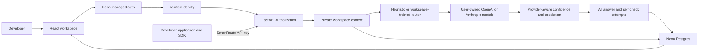

<!-- Record the approved hosted architecture, migration boundaries, and Neon setup procedure. -->
# SmartRoute Hosted Architecture

Approved on 2026-09-22. This document supersedes the original single-workspace
deployment assumptions. The original Phases 1-11 remain a working local prototype.

**Current checkpoint: M3 owned-model preview.** Neon migrations through
`0002_owned_inference` are applied. Managed sign-in, owner workspaces, gateway keys,
encrypted provider configuration, owned cloud routing, private attempt history,
settings/stats, and workspace-specific training run in a separate preview app.
Provider contracts and failures are tested with mocked HTTP; live paid inference
has not been verified. M4 SDK/onboarding is next. Public hosted mode remains
blocked until the M5 deployment gates are complete.

## Product Contract

SmartRoute supplies routing, tracking, and a management UI. Users supply model
access and pay their own inference provider. Each authenticated user initially
owns one private workspace. At least one enabled model must be configured before
chat or Test Lab runs are accepted. There are no shared hosted Ollama defaults.

The website provides login, model configuration, request inspection, feedback,
statistics, training controls, and an Integration page. The Integration page will
show the installation command and a one-time gateway API key only after the SDK
is actually published. Do not advertise a package as installable before publication.

The SDK calls the backend, not the browser app. Its API key identifies a workspace.
Provider configuration can be managed through the website or explicit SDK setup
methods with explicit owner authorization; ordinary gateway keys cannot administer
provider configuration. Routine chat calls reference saved models rather than
repeatedly changing configuration as an initialization side effect.

## Target Flow



## Security Boundaries

- Website sessions are managed by Neon. Backend identity must be verified with
  the configured branch's trusted signing keys/claims, never a browser-supplied
  user ID. Confirm issuer, audience, token expiry, and key-rotation behavior with
  the configured service before implementing token verification.
- API keys are random high-entropy values. Store only their SHA-256 hash, prefix,
  workspace, creation/expiry/last-use timestamps, and revocation state. Show the
  plaintext once. A gateway key is different from an OpenAI/Anthropic key.
- Provider keys are encrypted with authenticated encryption using a server-only
  secret kept outside Neon. The encrypted payload includes workspace and provider
  identity, so moving ciphertext between tenants/providers fails validation.
  Never return plaintext or ciphertext from list/read APIs.
- Workspace context comes from verified identity or a valid gateway key. All
  request, feedback, settings, model, key, training, and run operations require
  that context. Do not expose unscoped repository functions on hosted routes.
- Browser auth and SDK keys have separate permissions. Browser-authenticated
  owners manage keys and provider configuration; ordinary gateway keys do not
  automatically grant every administrative action.
- SQL tenant filters, cross-workspace foreign-key checks, and dedicated runtime
  role/RLS verification are required before public deployment. Schema ownership
  alone is not tenant isolation, and Neon owner roles may bypass RLS.
- Application tables live in `smartroute`; managed identity tables stay in
  `neon_auth`. Do not modify Neon's managed schema or expose application tables
  through the Data API during this migration.
- OpenAI and Anthropic use fixed server-controlled API roots initially. Arbitrary
  URLs, redirects to internal networks, user-supplied proxies, and laptop localhost
  access are out of scope. This avoids introducing a public SSRF proxy.
- Full prompts and answers are sensitive workspace data. Define retention and
  deletion, redact credentials from logs, and disclose backend/provider processing.

## Data Model

| Table | Purpose |
| --- | --- |
| `users` | Verified identity reference and application profile; no passwords |
| `workspaces` | One private workspace per owner; default free plan |
| `api_keys` | Hashed gateway keys and revocation/usage metadata |
| `provider_credentials` | Workspace-bound encrypted OpenAI/Anthropic keys |
| `models` | Owned credential reference, logical tier, model ID, prices, enabled flag |
| `workspace_settings` | Per-workspace confidence, escalation, reference pricing, and routing policy |
| `requests` | Workspace-scoped conversation, final response, routing and cost summary |
| `request_attempts` | Every answer and self-check's provider, model, usage, cost, and timing |
| `testlab_runs` | Workspace-scoped run summaries and result references |
| `router_models` | Per-workspace trusted classifier artifact, feature order, and metadata |

The provider-credential and request-attempt relationships include `workspace_id`
in their foreign keys. All runtime reads and writes still need authorization;
these constraints prevent incorrect references but do not replace tenant filters.
The `premium` plan value is reserved for future use; there is no payment system or
automatic charge for SmartRoute in this version.

## Model And Routing Changes

Users configure one to three logical tiers. A tier is a routing role, not a
claim about a vendor model's size or price. One model permits tracking but no
meaningful cross-model selection. Missing tiers never use the owner's credentials
or the historical local Qwen installation.

Forced routing must identify a configured, enabled tier or return a setup error.
Auto routing resolves its predicted tier among the workspace's enabled models
and explains any resolution in metadata. Native Anthropic request/response parsing
is required; Anthropic is not assumed to implement OpenAI's chat API.

Confidence checks must use the selected provider adapter, rather than always
calling Ollama. Cost and quota accounting include auxiliary self-checks and every
escalation attempt. Store reported token categories and distinguish estimates from
provider invoices, including cached-token pricing where applicable. Reference cost
is hypothetical; neither routing confidence nor tier-match accuracy guarantees
answer correctness.

Feedback trains only that workspace's routing classifier, not a base language
model. Do not load another tenant's local joblib file or use a shared training set.
Server-generated classifier artifacts remain trusted internal data, not uploads.

## Neon Setup

Use a development branch of the selected Neon project. Enable managed Auth in an
AWS region and configure email/password. Add `http://127.0.0.1:5173` and
`http://localhost:5173` as local trusted origins. Production domains, email
verification, session behavior, and recovery URLs are deployment checks, not
assumptions inherited from localhost.

Append the fields from [backend/.env.hosted.example](../backend/.env.hosted.example)
to the existing ignored backend environment file without replacing existing values:

- `DATABASE_URL`: pooled application connection, with TLS required.
- `DATABASE_DIRECT_URL`: direct migration connection for the same branch/database.
- `NEON_AUTH_BASE_URL`: public Auth Base URL from that branch's Auth configuration.
- `PROVIDER_ENCRYPTION_KEY`: server-only encryption key, generated locally below.
- `NEON_AUTH_ISSUER` / `NEON_AUTH_AUDIENCE`: exact expected signed claims. The
  configured service was verified to use its HTTPS origin, without `/database/auth`.
- `NEON_AUTH_ALGORITHM=EdDSA`: confirmed against the branch's public JWKS.
- `APP_MODE=local`: retain the prototype; use `preview` only for loopback testing.

Never paste connection strings, passwords, bearer tokens, or encryption keys into
assistant chat. Never put database credentials or the encryption key in `VITE_*`
variables. The frontend will receive only the public auth URL and API root.

From `backend/`, with dependencies installed:

```powershell
.\.venv\Scripts\python.exe -m app.hosted.setup derive-direct-url
.\.venv\Scripts\python.exe -m app.hosted.setup check
.\.venv\Scripts\python.exe -m app.hosted.setup generate-key
.\.venv\Scripts\python.exe -m app.hosted.migrate upgrade
.\.venv\Scripts\python.exe -m app.hosted.migrate check
.\.venv\Scripts\python.exe -m app.hosted.migrate current
```

`derive-direct-url` is optional and fills a missing direct URL only for a standard
Neon pooler hostname. `check` uses read-only queries and reports booleans, including
the presence of `neon_auth`; it does not prove a real login or JWT verification.
`generate-key` writes directly to the ignored environment file and does not rotate
an existing key. Back up that key in trusted deployment secret storage: losing it
means saved provider credentials cannot be decrypted.

Migrations target only `smartroute`, use the direct connection, and never run as an
automatic web-server startup side effect. Review each generated revision before
applying it. Keep immutable migration files in Git, but not credentials or database
dumps. The small application pool uses pooled connections and transaction-scoped
work; no request depends on PgBouncer retaining session settings.

## Migration Checkpoints

### M1: Foundation

Neon setup and direct/pooled verification, versioned schema, secret-handling
primitives, isolated tests, and updated documentation. The initial migration is
`0001_neon_foundation`. No HTTP route is moved to the new tables yet. Existing
SQLite data, file settings, and local model artifacts remain untouched.

`APP_MODE=hosted` deliberately fails startup at this checkpoint. The old HTTP app
is still unauthenticated and local-only. Do not describe it as safe to deploy just
because Neon tables and encryption helpers exist.

### M2: Identity And Isolation

Add custom login/signup/recovery screens using the managed auth SDK; verify backend
identity; provision one private workspace; create/list/revoke scoped SDK keys;
introduce workspace-required repositories and migrate history, feedback, settings,
stats, run history, and training access. Prove cross-user denial, expired/revoked
credential denial, and safe authorization on every route before any hosted access.

The preview mounts a separate authenticated router, never the legacy global
SQLite endpoints. It verifies access JWTs using the configured auth URL's
`/.well-known/jwks.json` endpoint and pinned issuer/audience/algorithm. It requires
expiry, issued-at time, and a subject, refreshes signing keys on a bounded schedule,
and ignores token-supplied key URLs. Passwords remain entirely with managed auth.

The installed Neon vanilla adapter puts the JWT in `getSession().data.session.token`.
This is the adapter's managed JWT field, not a generic Better Auth opaque cookie.
The frontend forwards it only as a bearer header. It does not authorize from decoded
claims. A missing session or changed subject clears workspace UI state; signing out
unmounts private views and one-time key displays. A captured JWT can remain valid
until its expiry even after browser sign-out. Short token lifetimes and provider
session-revocation behavior must be reviewed before public deployment.

The backend resolves the current profile and email-verification flag from the
managed `neon_auth.user` record, then provisions one workspace for that verified
issuer/subject. It never links accounts by an unverified email address. Verification
is required before creating a durable gateway key. Keys expire in 1-365 days, are
limited to 25 active keys per workspace, and can be revoked immediately.

Gateway keys can read their workspace data and submit owned feedback; they cannot
create/list/revoke keys, change settings, or trigger training. Owner-session routes
enforce workspace ownership even when a caller guesses another workspace's IDs.
The trainer reads and writes only that workspace's rows/artifact, not global files.

#### Run The Preview

Use `http://localhost:5174` for the frontend. Neon pre-approves localhost ports;
`127.0.0.1` is a separate origin and must be explicitly trusted. Add production
origins in Neon Auth's Configuration -> Domains with protocol and no trailing slash.
Do not disable callback validation to work around a configuration mismatch.

After confirming that your branch uses origin-based issuer/audience claims:

```powershell
cd backend
.\.venv\Scripts\python.exe -m app.hosted.setup configure-origin-claims
$env:APP_MODE = "preview"
.\.venv\Scripts\python.exe -m uvicorn app.main:app --host 127.0.0.1 --port 8001 --no-proxy-headers
```

In a separate terminal from the repository root:

```powershell
$env:SMARTROUTE_BACKEND_URL = "http://127.0.0.1:8001"
npm.cmd --prefix frontend run dev -- --host 127.0.0.1 --port 5174
```

These process-local variables leave the normal local server unchanged. The auth
URL comes from a public `/v1/client-config` bootstrap; no database credential or
server encryption key is returned to the browser. Keep `--no-proxy-headers` for
preview testing. The loopback check is not a public reverse-proxy security boundary:
do not put a public proxy in front of this preview.

| Preview endpoint | Access |
| --- | --- |
| `/v1/client-config`, `/health` readiness | Public, non-secret configuration/readiness |
| `GET /v1/me` | Verified session or valid gateway key |
| `GET/POST/DELETE /v1/api-keys` | Owner session; email verification additionally required to create |
| Requests, stats, tiers, settings reads, feedback, run history, training status | Authenticated workspace only |
| Settings writes and training | Owner session only |
| Credential metadata/deletion and model deletion | Owner session only |
| Credential creation/rotation and model configuration | Email-verified owner session only |
| Model reads, chat and Test Lab execution | Workspace session or gateway key; session inference requires verified email |

The SDK is still unpublished. The API Keys page deliberately does not present a
working installation command. Provider configuration is available in Models;
full integration guidance remains M4 work. Recovery/signup screens call managed APIs; real email delivery
and recovery links must be verified in the configured Neon project before deployment.

### M3: Bring Your Own Models

Implemented in authenticated preview. Owners save up to ten encrypted credentials
and one mapping per logical tier through Models or the owner-authorized APIs.
Credential reads expose only metadata/suffixes. Rotation keeps mappings; credential
deletion cascades mappings but preserves history. Model mappings can be updated,
disabled, or deleted independently. Browser and gateway-key chat use the same
workspace configuration, never environment-wide/local provider credentials.

Only fixed official OpenAI and Anthropic API roots are supported. No custom URL,
redirect, automatic retry, or provider discovery can redirect a saved secret.
Native Anthropic requests separate system messages and normalize text/usage.
Model availability uses a metadata endpoint, without generating billable tokens;
availability is not proof that generation options or account permissions will work.

Prices must be supplied explicitly in USD per 1,000 input/output tokens. Missing
or disabled forced tiers return 409. Auto resolves a predicted tier to the same
or next higher configured tier, otherwise the highest enabled one, and explains
the resolution. A missing learned-only classifier returns 503. There is no shared
model fallback. One configured model permits tracking, not cross-model selection.

Each lower-tier answer uses a same-provider, same-model confidence check. Its
output cap is independently configurable from 32-1024 tokens (default 256), which
allows more room than the local prototype's four-token check. Unparseable or
out-of-range ratings contribute 0.5 and are marked `neutral_fallback` in attempt
metadata. The highest tier skips the check and reports 1.0 by convention, not a
correctness probability. A checker transport/provider error fails the request.
Models may omit temperature entirely; Anthropic temperatures above 1 are capped
at 1 while OpenAI receives the gateway's 0-2 value.

Successful requests and all answer/self-check attempts are committed atomically
before returning a completion. `actual_cost_usd` sums their configured standard
rates. OpenAI cached/reasoning details and Anthropic cache-read/cache-creation
counts are retained; Anthropic input totals include those cache categories.
**Cache-specific discounts/premiums are not applied.** These are estimates, not
invoice-exact amounts. Standard response `usage` describes only the final answer;
request details expose all auxiliary/escalation usage and pricing markers.

Provider errors/timeouts/cancellation retain failed request and attempt records.
Unreported costs are `null`, never assumed free; prior known costs remain on their
individual attempts. Rejections before inference (missing model, invalid input,
capacity) make no billable call and do not create a request record. Failed requests
cannot receive feedback and are excluded from dashboard aggregates and training.
Dashboard spend/savings therefore cover completed requests, not every possible
provider charge. A browser abort does not guarantee cancellation at the provider;
server task cancellation is audited but cannot undo an already-billable call.

Preview limits: 128 text messages, 64,000 aggregate characters, 1-4096 answer
tokens (default 1024), and 120-second read/10-second connect provider timeouts.
Tools, media, unknown message fields, and streaming are rejected. One operation
per workspace and four per process bound chat/Test Lab concurrency. Test Lab runs
sequentially; a failed partial run retains its request attempts but no completed
run summary. Distributed limits, quotas, total request deadlines, and public abuse
controls remain M5 work. Do not expose preview through a public reverse proxy.

Validation covers native provider payloads, usage, redacted failures, redirects,
ownership, key rotation, forced-tier guards, cumulative costs, neutral checks,
cancellation, concurrent-request denial, SDK-key HTTP inference, and private
request/run history. Browser checks use synthetic credentials and responses;
the user elected mocked provider validation for this checkpoint.

### M4: Onboarding And SDK

Complete website model setup, key management, Integration instructions, and the
httpx-based Python client/CLI. Use gateway keys for identity and explicit setup
methods for saved provider configurations. Test a new account through model setup,
SDK chat, private history, feedback, and key revocation. Do not publish misleading
installation instructions before the package is available.

### M5: Public Deployment Gate

Verify least-privilege database access/RLS behavior, account/workspace isolation,
auth origins and recovery flows, rate limits, concurrency limits, prompt/token
limits, request timeouts, retention, secret rotation, and cost attribution. Define
single-process versus distributed limit enforcement explicitly. Add deployment
configuration, final architecture docs, and SDK publishing. Lift the hosted-mode
guard only after these gates pass.

No automatic import of shared local logs is planned. If wanted later, an explicit
owner-confirmed migration must assign every imported row to one workspace and
must never assign data based on unverified email addresses.

## Current Reference Documentation

- [Neon managed authentication](https://neon.com/docs/auth/overview)
- [React authentication API quick start](https://neon.com/docs/auth/quick-start/react)
- [Authentication flow](https://neon.com/docs/auth/authentication-flow)
- [Pooled and direct connections](https://neon.com/docs/connect/connection-pooling)

Service availability and free-plan allowances can change. Verify current provider
terms at deployment; a free SmartRoute plan does not make model inference or
hosting infrastructure free.